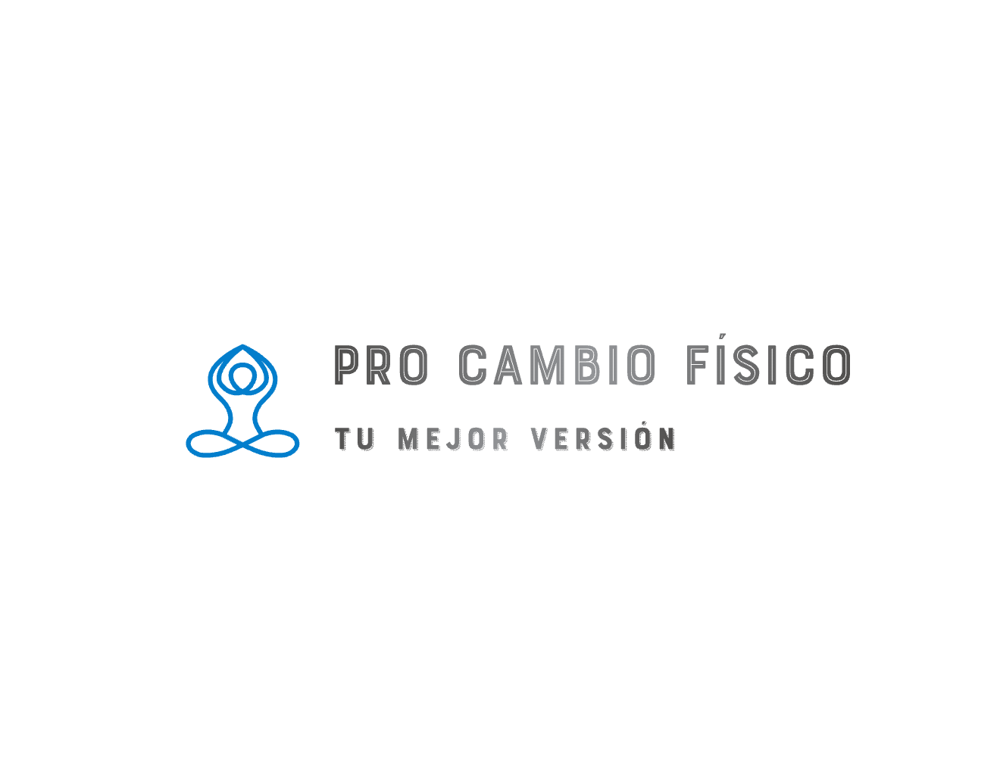

## proyecto: PRO Cambio Físico

``Plantilla para crear un proyecto de ideapolis``

Proyecto de Inteligencia Colectiva y Formación en la Empresa 

Un proyecto planificado en [Ideapolis](https://github.com/mgea/ideapolis/)

[Master en Gestión y Tecnologías de Procesos de Negocio](https://masteres.ugr.es/mbagestiontic/)

ETS Ingeniería Informatica y de Telecomunicación Univesidad de Granada

  
 

**Titulo** : PRO Cambio Físico

**Autor(es)** : Larissa Dantas, Yurismara León, Roberto López

**Resumen** : PRO Cambio Físico ayuda a personas con rutinas laborales exigentes o que no tengan una vida cotidiana sana a construir hábitos saludables mediante rutinas adaptadas a su estilo de vida. La marca busca reducir el estrés diario y mejorar el bienestar físico y emocional con pequeños cambios progresivos, motivación positiva y una experiencia flexible y accesible. Este cambio será acompañado por una comunidad que posea el mismo objetivo y con ello, los usuarios podrán encontrar un apoyo para la realización de ejercicios específicos y para la superación personal continua.
  
**logotipo** :

  

**Slogan**: "Encuentra tu mejor versión"

**Hashtag**  #PROCambioFisico #EncuentraTuMejorVersion

**Licencia** (usar una creative commons: revisar en https://creativecommons.org/licenses/?lang=es_ES) 

**Fecha** : 14/05/2026

**Medios** : 

* :octocat: GitHub: https://github.com/PROCambioFisico
* 🌐 Landing Page: https://www.procambiofisico.com
* 📱 App Store (iOS): https://apps.apple.com/app/procambiofisico
* 🤖 Google Play (Android): https://play.google.com/store/apps/procambiofisico
* 📸 Instagram: https://www.instagram.com/procambiofisico
* 🎵 TikTok: https://www.tiktok.com/@procambiofisico
* 📘 Facebook: https://www.facebook.com/procambiofisico
* 💼 LinkedIn: https://www.linkedin.com/company/procambiofisico

## ¿Quiénes somos?
Somos una comunidad que busca un cambio físico a traves del deporte y vida saludable. Buscamos crear hábitos e inculcarlos dentro del estilo de vida de las personas que aceptan este desafío y que vean resultados reflejados en cuanto a sentirse mejor y con más energía en el día a día. Este cambio no lo realizarán solos, sino que se hara el comunidad donde se encuentre el apoyo necesario para mantener una continuidad y también para superarse en grupo compartiendo experiencias, desafíos o bien acompañandose a entrenar en un mismo día y hora.

### Misión

 ``Manifiesto de la comunidad ``

#### Vision

## Metodología

**Metodología de desarrollo** :

PRO Cambio Físico se desarrolla bajo una estrategia de Diseño de 
Experiencia de Usuario (UX), centrada en cuatro pilares principales:

1. **Comunidad activa**: Los usuarios pueden crear y unirse a grupos de entrenamiento, realizando sesiones compartidas con amigos o conocidos (ej: "Clarita y Andrea — Sesión 5 semanal"), fomentando la motivación colectiva y el compromiso grupal.

2. **Hábitos progresivos** : La app guía a personas sedentarias hacia una vida más activa mediante rutinas adaptadas, recordatorios y seguimiento de progreso semanal.

3. **Contenido de valor** : Se entregan consejos prácticos de entrenamiento y vida deportiva, diseñados para integrarse fácilmente en la rutina diaria del usuario.

4. **Seguimiento y validación comunitaria**: El progreso semanal no es autoreportado — la comunidad es testigo activo del cumplimiento de los desafíos. Cada sesión completada puede ser verificada por los compañeros de grupo, eliminando la simulación de logros y fomentando una cultura de compromiso real y honesto con los objetivos deportivos.

El diseño UX prioriza la simplicidad, la accesibilidad y la motivación positiva, asegurando que cualquier persona, sin importar su nivel físico, pueda comenzar y mantener sus hábitos deportivos.

## Etapa 1: Ideación de proyecto 

Actividades realizadas mediante Trello https://trello.com/b/3YjvDccp/proyectomultimedia

**¿Como surge el proyecto?**
El proyecto surge debido a la experiencia de los integrantes del grupo con las actividades deportivas y el conocimiento en la creación de hábitos deportivos diarios y continuos. 
De acuerdo con esto, se propone compartir estos conocimientos de manera que personas las cuales no posean estos hábitos puedan adquirirlos de manera estructurada y organizada comenzando por pequeños cambios que en un principio no generen un impacto muy grande dentro de la cotidianidad.

**Investigación de campo**   Desk research propuestas inspiradoras para el proyecto) 

* @LadyDistopia (link) ...¿ por qué ?
* (...)
* identificar comunidades similares en otras rrss..

### Necesidad/oportunidad

> dafo

### Motivación de la propuesta

¿ por qué consideras interesante ? 

### Personas/Usuarios
(...¿en quién piensas que puede ser útil ? ¿cual es tu publico objetivo?) 

``Diseño de persona con characterAI``

## Etapa 2: Prototipar / productos 

(Productos que has desarrollado y como se plantea la integración de los diferentes medios, pon los que uses) 

* Imagen visual **moodboard**

     (Portada / Diseño de Interfaz) y herramienta usada
     ``moodboard``

* redes sociales (...) 

* publicidad/promoción:
    ``landing page``

* proyecto: grado de conclusión

    ``comunidad elgg``

## Etapa 3: Producción y evaluación

(Estrategia que plantearías para evaluar tu propuesta, medidodes e indicadores de éxito, elige / propone) 

### Estrategia para diseñar comunidada

### Preguntas frecuentes

## Conclusiones y trabajo futuro

* Grado de consecución del proyecto 
* Problemas identificados  (técnicos / sobre la idea inicial / planificacion… ) 
* Propuestas de mejora (por qué consideras que merece la pena continuar)
* Posible interés del proyecto (¿ Quien podría  colaborar / involucrarse en el proyecto? ¿viable?)

## Referencias y recursos

* [Proceso UX](https://uxmastery.com/resources/process/)
* [Diseño de Experiencias UX](http://www.nosolousabilidad.com/articulos/uxd.htm) 
* [Métodos UX](https://mgea.github.io/UX-DIU-Checklist/index.html) 
* [MuseMap: ejemplo de experiencia UX](https://blog.prototypr.io/musemap-street-art-app-ux-case-study-9bec6a99823b) 
* (...) 
* (Artículos ..  )
* (Productos utilizados ) 
* (Recursos tipo Imágenes, videos , etc.) 

Granada, Junio 202X
